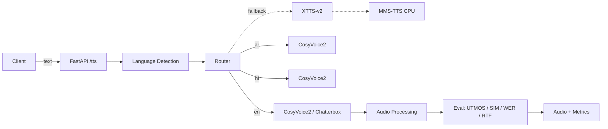

# Multilingual Voice AI Pipeline — EN / AR / HI

> **Open-source** TTS with voice cloning, streaming, automatic benchmarking, and
> a production FastAPI service. Built for an internship assignment answering:
> *"Which open-source pipeline gives the most human-like voice with the fastest
> response for each language, and why?"*

**TL;DR recommendation**

| Language | Primary engine | Why |
|---|---|---|
| **English** | **Chatterbox** (quality) / **CosyVoice2** (unified) | Aligned TTS → near-zero hallucination; best EN naturalness + trivial clone |
| **Arabic** | **CosyVoice2** | Native AR, streaming, cross-lingual clone, strong diacritization |
| **Hindi** | **CosyVoice2** | Native HI in the *same* model as EN/AR — one serving stack |

**The senior move:** run **one unified engine (CosyVoice2)** for all three
languages — streaming, zero-shot + cross-lingual voice cloning, Apache-2.0 — and
benchmark a **specialist (Chatterbox)** as the English contender. **Fish Speech
1.5** is wired in as an AR/HI alternative; fallbacks (XTTS-v2, MMS-TTS on CPU)
guarantee the service never hard-fails.

---

## Architecture



See [`reports/TECHNICAL_REPORT.md`](reports/TECHNICAL_REPORT.md) for the full
sequence diagram, design rationale, and the benchmark leaderboard.

## Quick start (local)

```bash
python -m venv .venv && source .venv/bin/activate
pip install -r requirements.txt
pip install cosyvoice chatterbox TTS utmos22-strong speechbrain jiwer whisper
cp .env.example .env

# Run the API
uvicorn src.api.server:app --host 0.0.0.0 --port 8000

# Try it
curl -X POST localhost:8000/tts/json \
  -H 'Content-Type: application/json' \
  -d '{"text":"Hello from open-source TTS!","language":"en"}'
```

## Quick start (Docker, GPU)

```bash
docker compose up --build
# → http://localhost:8000/docs
```

## Quick start (Google Colab / Kaggle)

Open [`notebooks/colab_setup.py`](notebooks/colab_setup.py) — one script installs
everything on a T4 and runs a smoke test. On Kaggle use the same pip lines with
Accelerator=GPU.

## Interactive demo (Gradio)

```bash
pip install gradio fish-speech
python demo_ui.py            # → http://localhost:7860
# or: python -m src.ui.gradio_app
```

Type in EN/AR/HI, optionally upload a reference voice for cloning, pick a backend
(or leave blank for the router to choose). Reuses the exact same `TTSRouter` as
the API, so routing + fallback behave identically.

> **Reference voices:** CosyVoice2 and Fish Speech require a reference `.wav`
> (set `voices.<lang>` in `config.yaml` or upload in the UI). Chatterbox/XTTS
> clone optionally; MMS-TTS needs no reference. Drop files in `assets/voices/`.
>
> **Fish Speech is optional:** if the `fish-speech` package isn't installed (or
> its API differs by version), the `fishspeech` backend simply fails to load and
> the router falls through to the next engine — it never blocks the pipeline.

## Interactive demo (Streamlit)

A Streamlit alternative to the Gradio demo, with the same router, cloning, and
metrics panel (backend, RTF, latency, char count, GPU memory).

```bash
pip install streamlit
python streamlit_demo.py          # → http://localhost:8501 (preferred: no path typing)
# or directly:
streamlit run src/ui/streamlit_app.py
```

Type in EN/AR/HI, optionally upload a reference voice for cloning, pick a backend
(or leave blank for the router to choose), then hit **Generate Speech**. Like the
Gradio demo it reuses the exact same `TTSRouter` as the API.

## Benchmarking

```bash
python benchmarks/run_benchmarks.py --langs en ar hi --backends cosyvoice2 chatterbox
# → benchmarks/results/benchmark_results.csv + radar_*.png, bar_*.png, leaderboard.png
```

Run `python scripts/repo_stats.py` on submission day to refresh live GitHub stars.

## Project layout

```
src/
  core/      config, language detection, router
  tts/       backends: cosyvoice2, chatterbox, xtts, mmsts  (one interface)
  api/       FastAPI server + schemas
  eval/      metrics (UTMOS, WavLM similarity, Whisper WER) + benchmark harness
  utils/     gpu, audio
benchmarks/  prompts + runner
notebooks/   colab/kaggle setup
reports/     technical report, roadmap, presentation, email
tests/       smoke tests (CPU fallback path)
```

## Evaluation methodology (honesty matters)

True MOS needs human raters, so we report **predicted MOS** via UTMOS22 (a strong
SSL-MOS model from the VoiceMOS Challenge 2022) and clearly label it. Speaker
similarity uses a WavLM-large encoder (cosine). WER uses Whisper + jiwer.
Latency, RTF, and GPU memory are measured directly. All metrics degrade
gracefully if a dependency is missing.

## License

Code: MIT. Engines: Apache-2.0 (CosyVoice2, XTTS-v2, Fish Speech, IndexTTS-2) /
MIT (Chatterbox, MMS-TTS, Bark). See individual repos.
